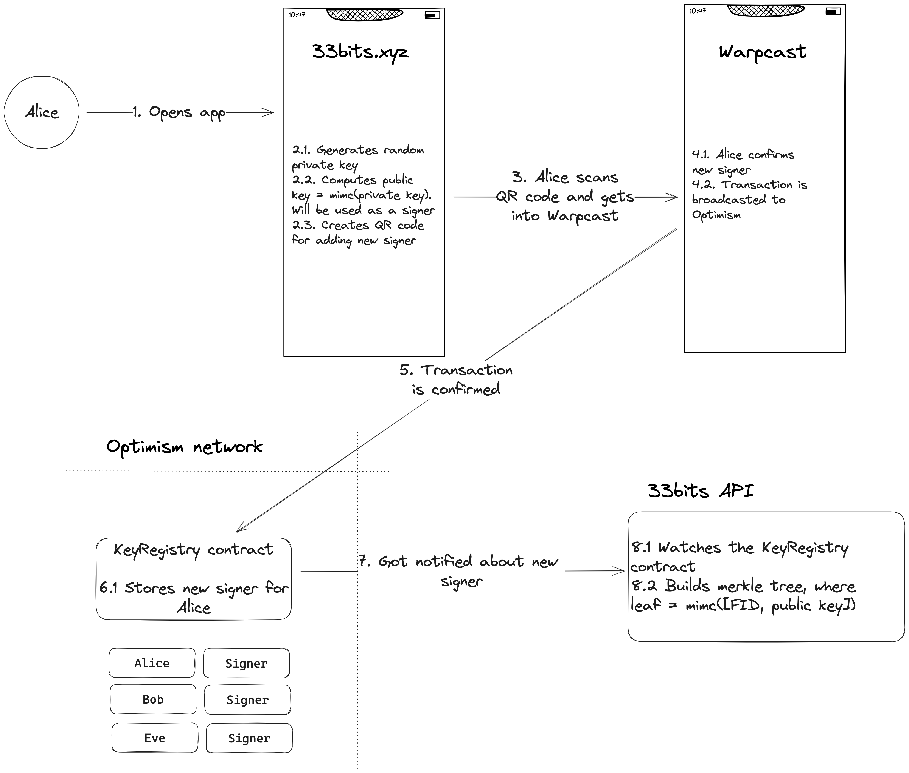
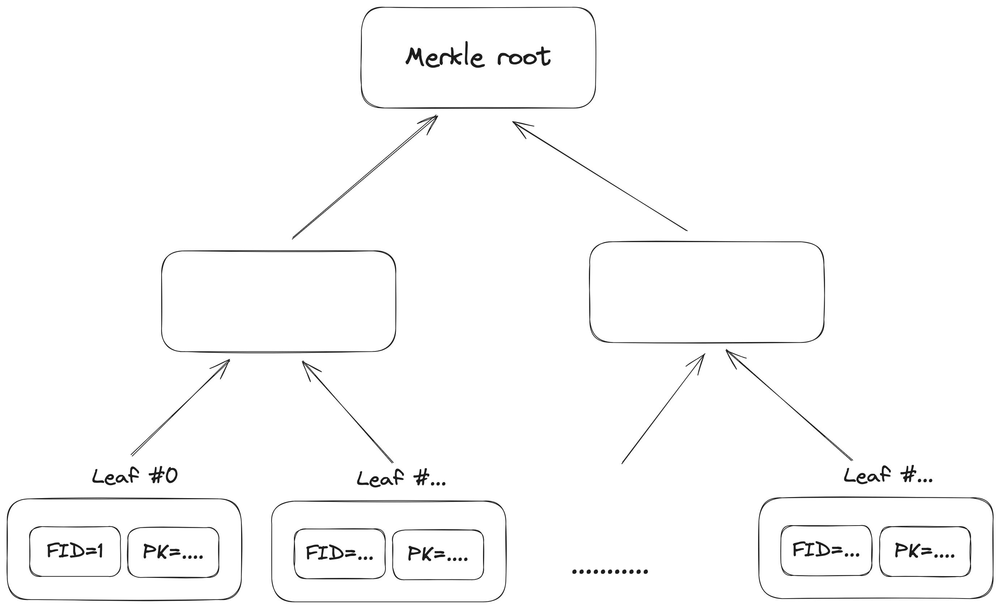
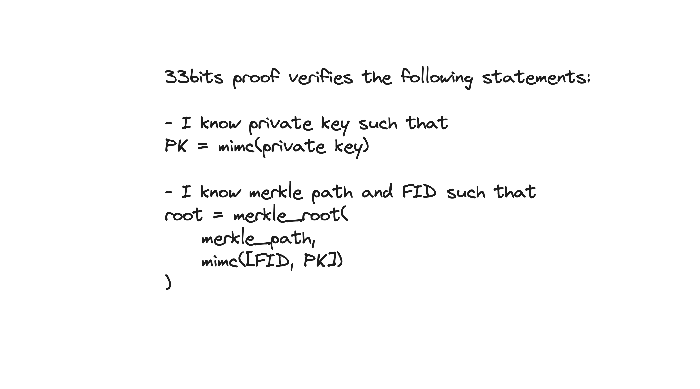
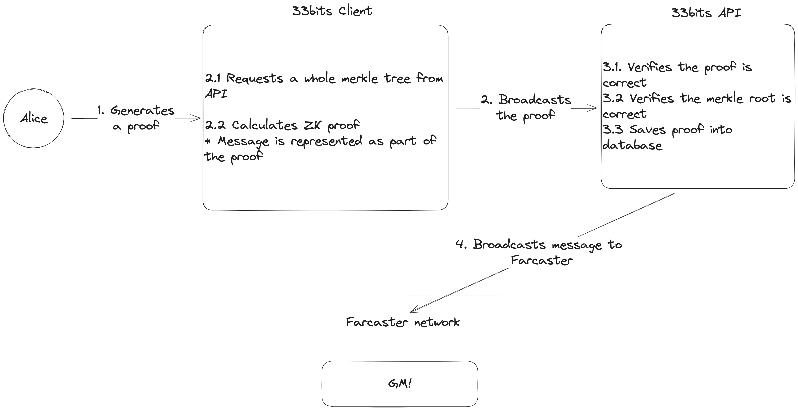

# [33bits.xyz](http://33bits.xyz) Explained

This document provides a top-level explanation of how [33bits.xyz](http://33bits.xyz/) works under the hood.

1. Authentication Process: Sign in with Warpcast
2. Merkle Tree Scheme
3. Zero-Knowledge Proof Scheme
4. Sending a Cast to Farcaster

Post privately on Farcaster through [33bits.xyz](https://33bits.xyz/). Zk prove that your FID ≤ 10001 and cast on the [@33bits](https://warpcast.com/33bits) feed without revealing your personal account. This project is built with the intention to provoke open dialogues and explore how the Farcaster community will use or abuse their privacy.

### **Sign In**

When a user signs in with Warpcast, the 33bits app links their FID with a new signer. To post a cast, the user must prove that their FID is ≤ 10001 through zero-knowledge (zk) proofs. This proof is generated using the user’s new signer. The entire process, including authentication and proof generation, occurs in the user's browser, keeping their FID private. After the new signer is approved by the user, a transaction with signer information is automatically broadcasted to the Farcaster `KeyRegistry` contract on Optimism. Meanwhile, 33bits API monitors the blockchain, building a Merkle tree with all the signers. This Merkle tree is used for zero-knowledge proofs - 33bits app proves that the user’s public key is in the tree without revealing the exact position.



*33bits adds a new signer, but with read-only permissions! This signer cannot be used for casting into the user’s profile. The public key is not a “real” public key, obtained by multiplying the private key with the generation point. Instead, it’s just a hash value ([Github](https://github.com/33bits-xyz/app/blob/main/src/utils/keygen.ts#L29)). So, by authenticating 33bits, you’re granting read-only permissions.*

### ****Merkle Tree Scheme****

 tree is a data structure that efficiently verifies large data sets. It's a tree where each leaf is a data block and each non-leaf node is a hash of its children. This forms a root hash at the top, representing the entire data set. Changes in any block alter the root hash, allowing quick verification of data integrity.



In case of 33bits, the tree’s leaf is a MiMc hash of two values: FID and public key.

```jsx
leaf = MiMC([fid, public_key])
```

### Zero-knowledge proof scheme

ZK proofs allow users to cast messages anon through 33bits.xyz. Users must prove their Farcaster account is valid & their FID (Farcaster ID) ≤ 10001, while keeping their exact FID private. Key point: while the user's private key and FID are secret, the Merkle root of the proof is public. The API uses this root to verify the proof against its Merkle root without seeing private details. This setup keeps the message casting secure and private, with the message itself being part of the proof.



### ****Sending a Cast to Farcaster****

Each time a user sends a cast through 33bits, the app generates a new zk proof. This process requires significant computational power and memory usage. As a result, depending on the user's device, it may take up to 2 minutes to complete.



After receiving a new proof, the backend verifies it, ensures that merkle root is the same as local's one, and casts message onto the FC network. 

For a deeper dive into zk, please refer to [app/README](https://github.com/33bits-xyz/app ).

If you're curious to learn more about zero-knowledge proofs, watch [Dan Boneh's ZK Whiteboard sessions](https://www.youtube.com/watch?v=h-94UhJLeck&list=PLj80z0cJm8QErn3akRcqvxUsyXWC81OGq&ab_channel=ZeroKnowledge).

We are actively working on 33bits and the documentation for it. If you have any questions or feedback, reach out to [@fastfourier.eth](https://warpcast.com/fastfourier.eth) or [@kugusha.eth](https://warpcast.com/kugusha.eth). 

This project is inspired by [@heyanon](https://www.heyanon.xyz/) and [@coinfessions](https://twitter.com/coinfessions).